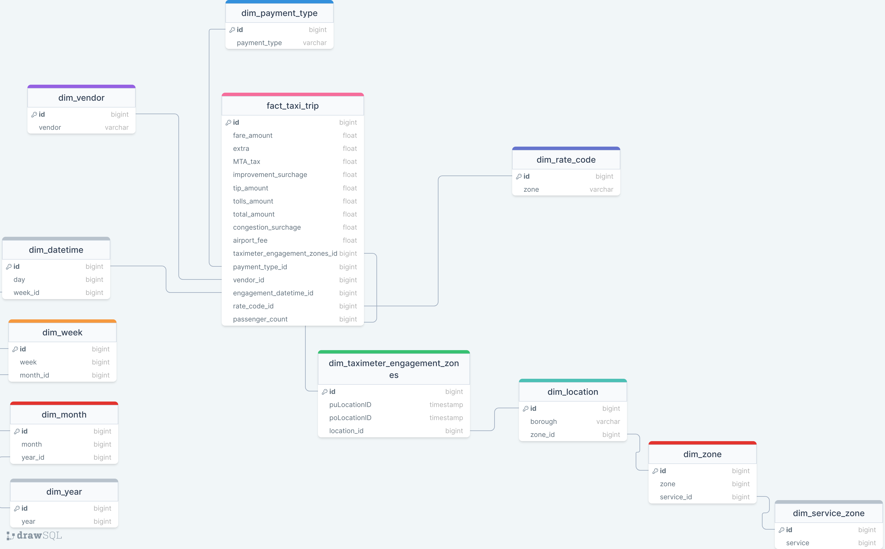
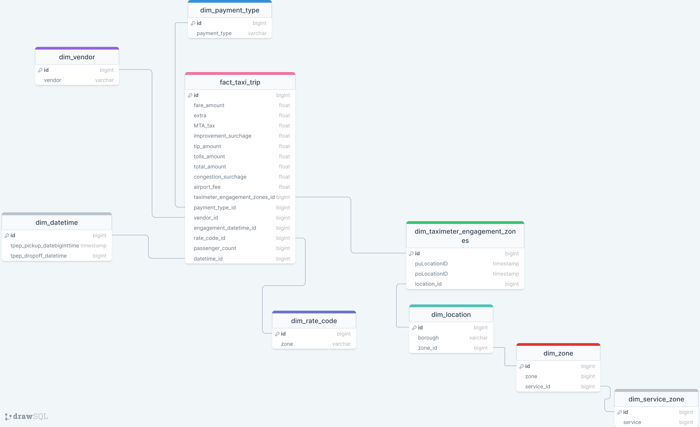

# Atelier - Architecture Décisionnel (Datamart) | Projet New York Taxi Trip

Hi! I'm your first Markdown file in **StackEdit**. If you want to learn about StackEdit, you can read me. If you want to play with Markdown, you can edit me. Once you have finished with me, you can create new files by opening the **file explorer** on the left corner of the navigation bar.

# Sommaire

 -  Arborescence des fichiers
 - **TP 1** Businness Intelligence
 - **TP 2** Systéme d'alimentation
 - **TP 3** Stockage et datamarts

## Arborescences des fichiers

├── src
│   ├── data
│   │   ├── grab_parquet.py
│	  │	│── dum_to_sql.py
│	  │	│── creation.py
│	  │	│── creation_location_dim.py
│	  │	│── insertion_location_dim.py
│	  │	│── insertion.py
├── data
│   ├── raw
│   │   	└── taxi_zone_lookup.csv
│    │    	└── yellow_tripdata_2023-11.parquet
│   │   	└── yellow_tripdata_2023-11.parquet
 ├── models
│      ├── creation.sql
│      └── creation_location_dim.sql
│      └── insertion.sql
│      └── delete.sql
 ├── docs
│      ├── Rapport.md
└── ...

##  TP 1 Business Intelligence

    grab_parquet.py

Le script `grab_parquet.py` a pour objectif de récupérer des données sur les trajets en taxi à New York depuis un service en ligne, puis de les stocker dans un service de stockage objet Minio. Voici comment il fonctionne :

1.  **Téléchargement des données** : Le script commence par définir une liste de mois et une année spécifiques pour lesquels les données de trajets de taxi doivent être téléchargées. En utilisant une URL de base et les mois de la liste, le script construit les URL de téléchargement des fichiers Parquet. Il télécharge ensuite chaque fichier Parquet depuis les URL spécifiées et les enregistre localement dans un répertoire spécifié.
    
2.  **Stockage des données dans Minio** : Une fois que tous les fichiers Parquet ont été téléchargés et enregistrés localement, le script se connecte à un serveur Minio en utilisant les informations d'identification spécifiées. Il vérifie si un bucket spécifié pour le stockage des données existe déjà. Si le bucket n'existe pas, il est créé. Ensuite, le script charge chaque fichier Parquet dans le bucket Minio.
    
3.  **Gestion des erreurs** : Le script gère les erreurs qui pourraient survenir lors du téléchargement des fichiers Parquet depuis les URL spécifiées, lors de la connexion à Minio ou lors du chargement des fichiers dans Minio. En cas d'erreur, il affiche un message d'erreur approprié et termine l'exécution avec un code de sortie non nul.  

**Bibliothéques et modules :**
| Modules | Description |
|--|--|
|  Minio| Minio est un client Python pour interagir avec le service de stockage objet Minio, qui est compatible avec l'API S3. Il permet de manipuler des objets dans des buckets Minio, tels que l'ajout, la récupération et la suppression d'objets. |
|pandas| Pandas est une bibliothèque Python très populaire pour la manipulation et l'analyse de données. Elle offre des structures de données puissantes et des outils pour lire, écrire, filtrer, trier et manipuler des données tabulaires.|
|pyarrow.parquet|PyArrow est une bibliothèque Python qui fournit des fonctionnalités pour le traitement des données en mémoire et l'échange de données entre différents systèmes. Le module `parquet` de PyArrow est utilisé ici pour lire des fichiers Parquet.|
|S3Error|`S3Error` est une classe d'exception spécifique à Minio qui est levée en cas d'erreur lors d'une opération sur le service de stockage objet Minio.|
|sys|Le module `sys` fournit un accès à certaines variables utilisées ou maintenues par l'interpréteur et à des fonctionnalités liées à l'environnement système.|
|os| Le module `os` fournit des fonctionnalités pour interagir avec le système d'exploitation, telles que la manipulation de chemins de fichiers, la création de répertoires et d'autres opérations liées au système de fichiers.|
|requests|Requests est une bibliothèque HTTP élégante et simple à utiliser pour Python. Elle permet d'effectuer facilement des requêtes HTTP vers des serveurs web et de récupérer les réponses. Dans ce script, `requests` est utilisé pour télécharger des fichiers à partir d'URLs spécifiées.|

**Les Fonctions :**

> grab_data()

Cette fonction est responsable de l'initialisation du processus de récupération des données. Elle crée le répertoire de destination s'il n'existe pas déjà, définit les mois et l'année pour lesquels les données doivent être récupérées, puis construit les URL de téléchargement des fichiers Parquet. Ensuite, elle appelle la fonction `download_file()` pour chaque URL.

> download_file()

Cette fonction télécharge un fichier à partir de l'URL spécifiée et le sauvegarde localement dans le répertoire spécifié. Elle utilise la bibliothèque `requests` pour effectuer la requête HTTP et télécharger le contenu du fichier. Une fois le fichier téléchargé, il est enregistré dans le répertoire spécifié.

> get_file_from_directory()

Cette fonction parcourt tous les fichiers présents dans le répertoire spécifié. Elle filtre les fichiers pour ne conserver que ceux avec l'extension ".parquet". Ensuite, elle appelle la fonction `write_data_minio()` pour chaque fichier Parquet trouvé.

> write_data_minio()

Cette fonction est chargée d'écrire les fichiers Parquet dans le service de stockage objet Minio. Elle utilise la bibliothèque `Minio` pour se connecter au serveur Minio et vérifier si le bucket spécifié existe déjà. Si le bucket n'existe pas, il est créé. Ensuite, la fonction charge chaque fichier Parquet dans le bucket Minio en utilisant la méthode `put_object()` de la bibliothèque Minio.

## TP 2 Systéme d'alimentation (ETL)

    dump_to_sql.py
    
Le script `dump-to-sql.py` a pour objectif de transférer les données stockées dans des fichiers Parquet vers une base de données PostgreSQL. Voici comment il fonctionne :

1.  **Configuration de la base de données et du service de stockage** : Le script commence par définir les informations de connexion à la base de données PostgreSQL dans le dictionnaire `db_config`. Il spécifie également les informations de connexion au service de stockage Minio dans le dictionnaire `minio_config`.
    
2.  **Connexion au service de stockage** : Le script utilise la bibliothèque Minio pour se connecter au service de stockage Minio, en utilisant les informations de connexion fournies dans `minio_config`. Il récupère ensuite la liste des objets stockés dans le bucket Minio spécifié.
    
3.  **Traitement des fichiers Parquet** : Le script parcourt tous les objets Parquet trouvés dans le bucket Minio. Pour chaque fichier Parquet, il récupère le contenu de l'objet, le lit en utilisant la bibliothèque Pandas, et nettoie les noms de colonnes en les convertissant en minuscules.
    
4.  **Transfert des données vers la base de données** : Une fois les données Parquet chargées dans un DataFrame Pandas et nettoyées, le script utilise SQLAlchemy pour établir une connexion à la base de données PostgreSQL. Il écrit ensuite les données du DataFrame dans la table spécifiée dans `db_config`.
    
5.  **Nettoyage de la mémoire** : Après le transfert des données, le script supprime le DataFrame pour libérer la mémoire.
    
6.  **Gestion des erreurs** : Le script gère les erreurs qui pourraient survenir lors de la connexion au service de stockage ou lors de l'écriture des données dans la base de données. En cas d'erreur, il affiche un message d'erreur et termine l'exécution avec un code de sortie non nul.

**Bibliothéques et modules :**
|Modules| Description |
|--|--|
| gc | Ce module fournit une interface pour le ramasse-miettes, qui est un mécanisme de gestion automatique de la mémoire en Python. Il permet de contrôler le comportement du ramasse-miettes et d'effectuer des opérations liées à la gestion de la mémoire. |
| sys |Ce module fournit un accès à certaines variables utilisées ou maintenues par l'interpréteur Python et à des fonctions qui interagissent fortement avec l'interpréteur. Il est souvent utilisé pour manipuler des variables système, gérer les arguments de la ligne de commande et contrôler le flux de sortie standard.  |
| io.BytesIO | Il fournit une interface pour traiter les données binaires en mémoire sous la forme d'un objet de flux (stream). Il est utilisé ici pour créer un objet de flux en mémoire à partir des données récupérées depuis un objet Minio, afin de lire ces données en tant que DataFrame pandas. |
| pandas | C'est une bibliothèque Python populaire pour la manipulation et l'analyse des données. Elle fournit des structures de données flexibles et performantes, ainsi que des outils pour lire et écrire des données dans différents formats. |
| Minio | C'est une bibliothèque Python pour interagir avec MinIO, qui est un serveur de stockage d'objets compatible avec Amazon S3. Elle permet de gérer des buckets, d'envoyer et de récupérer des objets, et d'effectuer d'autres opérations liées au stockage d'objets. |
| sqlalchemy.create_engine | SQLAlchemy est une bibliothèque Python pour travailler avec des bases de données relationnelles. La fonction `create_engine` est utilisée pour créer un moteur de base de données SQLAlchemy, qui fournit une interface pour se connecter à une base de données et exécuter des requêtes SQL. |

**Les Fonctions :**

> main()

La fonction `main()` dans ce fichier est le point d'entrée du programme. 
Elle configure les informations nécessaires pour se connecter à un serveur Minio où sont stockés les fichiers Parquet.
Elle tente de se connecter au serveur Minio en utilisant les informations de configuration.
Si la connexion réussit, elle récupère la liste des objets stockés dans un bucket spécifique.
Elle parcourt tous les objets Parquet trouvés dans le bucket.
Pour chaque objet Parquet, elle récupère le contenu et le lit en tant que DataFrame pandas.
Elle nettoie les noms de colonnes du DataFrame en appelant la fonction `clean_column_name()`.
Elle écrit les données du DataFrame dans une base de données PostgreSQL en appelant la fonction `write_data_postgres()`.
Si une erreur se produit à un moment donné, elle l'affiche et termine l'exécution du programme. Sinon, elle affiche un message de confirmation indiquant que tous les fichiers Parquet ont été traités avec succès.

> write_data_postgres()

Elle établit une connexion à une base de données PostgreSQL à l'aide des informations de connexion spécifiées dans la fonction.
Ensuite, elle insère les données du DataFrame dans une table spécifiée dans la base de données PostgreSQL.
La fonction renvoie un booléen pour indiquer si l'opération s'est déroulée avec succès ou non.

> clean_column_name()

Cette fonction prend en entrée un objet DataFrame de pandas.
Elle renomme toutes les colonnes du DataFrame en les convertissant en minuscules.
La fonction retourne le DataFrame modifié avec les noms de colonnes en minuscules.

## TP 3 Stockage et Datamarts
 
L'objectif est de concevoir une structure de base de données qui soit efficace et qui reflète au mieux les besoins et les caractéristiques des données. 
Cela implique d'identifier les entités, les relations entre celles-ci, ainsi que les attributs pertinents pour chaque table. En outre, il est nécessaire de nettoyer et de classer les données afin de garantir leur qualité et leur cohérence une fois intégrées dans la base de données. Ce processus de nettoyage et de classification est essentiel pour assurer la fiabilité et l'utilité des informations stockées dans la base de données.

Dans ce cadre, un modèle en flocons a été envisagé(img1), offrant une granularité accrue dans la représentation des données, mais lors de la mise en pratique, une approche plus pragmatique a été adoptée(img2). Il a été décidé de privilégier la mise en œuvre d'un modèle plus simple et plus direct, ce qui a permis d'avancer plus rapidement dans la réalisation des TP.

    
    creation.sql

Le script `creation.sql` définit la structure de la base de données suivant un principe de relations entre les différentes tables grâce à l'utilisation de clés étrangères. Les tables sont créées de manière à représenter les différentes dimensions et la table de faits de notre DataMart.

Tout d'abord, les tables de dimensions sont créées pour représenter des entités telles que la date et l'heure des trajets, le fournisseur de services de taxi, le type de paiement, le code tarifaire, les zones de service et de localisation. Chaque table de dimension est associée à une clé étrangère dans la table de faits pour maintenir l'intégrité référentielle.

Ensuite, la table de faits `fact_taxi_trip` est créée pour enregistrer les mesures relatives aux trajets en taxi, telles que le nombre de passagers, la distance du trajet, le montant du tarif, les pourboires, etc. Cette table fait référence aux tables de dimensions à travers des clés étrangères pour lier les mesures aux dimensions appropriées.	

    creation.py

Le script `creation.py` permet de créer la base de données PostgreSQL ainsi que les tables associées à partir d'un fichier SQL de définition de schéma. Voici un résumé des fonctionnalités implémentées :

**Création de la base de données :** Le script établit une connexion au serveur PostgreSQL en utilisant les informations de connexion fournies. Il vérifie ensuite si la base de données `nyc_datamart` existe déjà en exécutant une requête SQL. Si la base de données n'existe pas, elle est créée en exécutant une instruction SQL de création de base de données.

**Création des tables :** Une fois la base de données créée ou vérifiée, le script établit une connexion à la base de données `nyc_datamart`. Il charge le fichier SQL `creation.sql` qui contient les instructions de création des tables de dimensions et de la table de faits. Le contenu du fichier SQL est exécuté à l'aide de la méthode `execute()` du curseur PostgreSQL. 

**Bibliothèques et Modules :**
|Modules| Description |
|--|--|
| psycopg2 | C'est une bibliothèque Python populaire pour travailler avec des bases de données PostgreSQL. Elle fournit une interface pour se connecter à une base de données PostgreSQL, exécuter des requêtes SQL et effectuer d'autres opérations liées à la base de données. |
|psycopg2.sql|Ce module fournit des objets et des fonctions pour construire dynamiquement des requêtes SQL de manière sécurisée. Il permet de générer des requêtes SQL en utilisant des méthodes sécurisées pour l'insertion de valeurs, évitant ainsi les vulnérabilités telles que les injections SQL.|
|psycopg2.OperationalError|C'est une exception spécifique de psycopg2 qui est levée en cas d'erreur opérationnelle lors de l'interaction avec la base de données PostgreSQL. Elle peut être utilisée pour capturer et gérer les erreurs qui surviennent pendant l'exécution des opérations sur la base de données.|

    insertion.sql
Le script insertion.sql est un fichier SQL contenant les requêtes d'insertion des données dans les tables de la base de données Datamart.

    insertion.py

Le processus d'insertion des données de localisation extraites du fichier CSV dans notre base de données a été réalisé à l'aide du script Python `insertion.py`. Ce script effectue plusieurs étapes pour garantir la qualité et l'intégrité des données insérées.

Tout d'abord, le script lit le fichier CSV contenant les données de localisation des zones de taxi. Après avoir ignoré la première ligne contenant les en-têtes, le script parcourt chaque ligne du fichier CSV.  

**Bibliothèques et Modules :**
|Modules| Description |
|--|--|
| csv |Ce module fournit des fonctionnalités pour lire et écrire des fichiers CSV (valeurs séparées par des virgules). Il permet de parcourir les lignes et les colonnes d'un fichier CSV, de les lire dans des structures de données Python et d'écrire des données depuis des structures de données Python dans un fichier CSV.  |
| psycopg2 | Comme mentionné précédemment, c'est une bibliothèque Python pour travailler avec des bases de données PostgreSQL. Elle permet de se connecter à une base de données PostgreSQL, d'exécuter des requêtes SQL et d'effectuer diverses opérations de base de données. |

**Les Fonctions :**

> get_data_from_csv()

Avant d'insérer les données dans les tables de la base de données, un nettoyage est effectué. Les valeurs de `service_zone`, `zone` et `borough` sont extraites de chaque ligne du fichier CSV. Ces valeurs sont ensuite nettoyées en supprimant les espaces blancs et en les convertissant en minuscules, assurant ainsi la cohérence des données.

Pour éviter les doublons, le script vérifie d'abord si les valeurs de `service_zone`, `zone` et `borough` existent déjà dans les tables respectives (`dim_service_zone`, `dim_zone` et `dim_location`). Si une valeur existe déjà, elle n'est pas insérée à nouveau dans la base de données. De plus, les lignes où `borough` est égal à "N/A" dans la table `dim_location` et où `zone` est égal à "N/A" dans la table `dim_zone` sont exclues de l'insertion.

Une autre mesure prise pour assurer l'intégrité des données est la réinitialisation des séquences d'ID des tables. Cela garantit que les nouveaux enregistrements commencent à partir de 1, évitant ainsi toute confusion ou conflit avec les ID existants dans la base de données.

> insert_data_from_warehouse()

Cette fonction assure le transfert de données de la base de données source (`nyc_warehouse`) vers la base de données cible (`nyc_datamart`), en nettoyant et classant les données selon la structure du modèle de données défini.
1.  **Connexion aux bases de données :** Elle se connecte à la base de données `nyc_warehouse` et à la base de données `nyc_datamart` à l'aide de `psycopg2`.
    
2.  **Insertion de données statiques :** Elle insère des données statiques dans les tables de dimension `dim_vendor`, `dim_payment_type`, et `dim_rate_code` de la base de données `nyc_datamart`.
    
3.  **Insertion de données dynamiques :** Elle récupère les données des tables `dim_service_zone`, `dim_zone`, `dim_location`, `dim_datetime`, et `fact_taxi_trip` depuis la base de données `nyc_warehouse`, puis les insère dans les tables correspondantes de la base de données `nyc_datamart`.
    
4.  **Gestion des erreurs :** En cas d'erreur lors de la connexion ou de l'insertion des données, elle affiche un message d'erreur et quitte le programme avec un code d'erreur.
    
5.  **Fermeture des connexions :** Elle ferme les connexions à la base de données une fois toutes les opérations terminées.

⚠️ Suite à des problèmes rencontrés pour copier les données de la table `dim_location` de la base de données source vers la base de données cible, j'ai décidé de créer les tables de dimension directement dans la base `nyc_warehouse` en utilisant les données provenant du fichier Excel. Pour ce faire, j'ai créé deux scripts Python : `creation_location_dim.py` pour créer les tables de dimension et `insertion_location_dim.py` pour insérer les données correspondantes.

Une fois que ces scripts ont été exécutés avec succès, on peut alors lancer les scripts `creation.py` et `insertion.py` pour créer et insérer les autres données nécessaires dans la base de données cible.

Voici la liste des fichiers à lancer pour réaliser ces opérations :

1.  **Création et insertion des tables de dimension depuis le fichier Excel :**
    
    -   `creation_location_dim.py`
    -   `insertion_location_dim.py`
2.  **Création et insertion des autres données dans la base de données cible :**
    
    -   `creation.py`
    -   `insertion.py`

